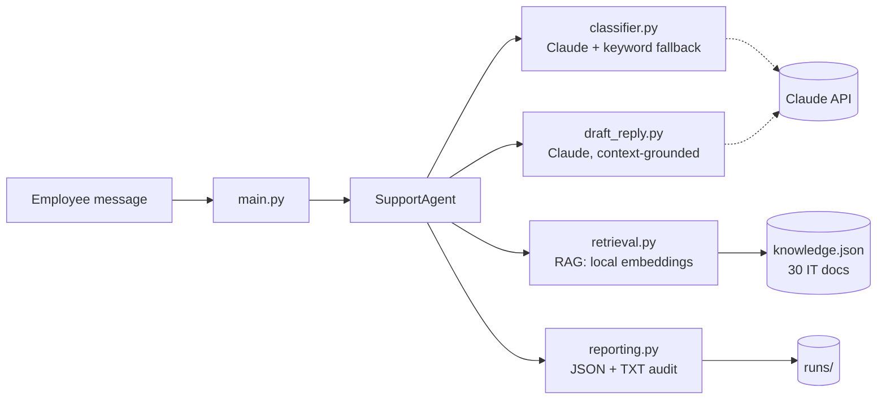

# IT Help Desk Support Agent 🤖

> A grounded, auditable AI support agent that triages IT requests and answers them using **Retrieval-Augmented Generation (RAG)** — never hallucinating policies, URLs, or ticket numbers.


<!--
After pushing to GitHub, add the live CI badge (replace YOUR-USERNAME):
[](https://github.com/YOUR-USERNAME/it-helpdesk-agent/actions/workflows/ci.yml)
-->

---

## Screenshot

<!-- Save a screenshot of the running web UI as docs/screenshot.png, then uncomment: -->
<!--  -->

The Streamlit web interface offers a clean single page: a request text area,
color-coded **category** and **urgency** badges, security/low-confidence
warning banners, the grounded reply, and an expandable panel with the
retrieved knowledge-base documents and similarity scores.

---

## What it does

An employee types an IT problem in plain language. The agent:

1. **Classifies** the request (category + urgency) with Claude.
2. **Retrieves** the most relevant passages from a local knowledge base (RAG).
3. **Drafts a grounded reply** using *only* the retrieved context — with strict anti-hallucination guardrails.
4. **Saves a full audit report** (JSON + TXT) for every run.

It is designed to **degrade gracefully**: if the LLM API is unreachable, a keyword-based classifier and a safe fallback reply keep the system usable.

---

## Architecture



**Pipeline:** `classify → retrieve → draft → report`. Each stage is independently testable and logged.

---

## Features

| Feature | Description |
|---|---|
| 🎯 **Auto triage** | Structured label (`VPN`, `SECURITY`, …) + urgency (`LOW/MEDIUM/HIGH`) |
| 📚 **RAG grounding** | Replies use only retrieved KB passages — no invented URLs or policies |
| 🛡️ **Security policy enforcer** | `SECURITY` requests are flagged (`security_flag: true`) in the audit log |
| 🕳️ **Knowledge-gap tracking** | Best similarity score < 0.3 → `low_confidence: true` (KB coverage gap) |
| ⏱️ **SLA tracker** | End-to-end latency recorded as `response_time_ms` per run |
| ♻️ **Graceful degradation** | Keyword fallback classifier + safe fallback reply on API failure |
| 🧾 **Full auditability** | Every run persisted to `runs/run_*.json` and `runs/reply_*.txt` |
| 🔒 **Local embeddings** | `sentence-transformers` runs on-device — no embedding data leaves the machine |

---

## Prerequisites

- Python **3.10+**
- An Anthropic API key ([console.anthropic.com](https://console.anthropic.com))

## Installation

```bash
git clone <your-repo-url>
cd it-helpdesk-agent

python -m venv venv
# Windows
venv\Scripts\activate
# macOS / Linux
source venv/bin/activate

pip install -r requirements.txt
```

Create a `key.env` file in the project root:

```env
ANTHROPIC_API_KEY=sk-ant-your-key-here
```

> `key.env` is git-ignored. It is the single source of truth for the API key.

## Usage

### Easy mode — web frontend (recommended)

Double-click the launcher in the project root:

- **Windows:** `start.bat`
- **macOS / Linux:** `start.command` (run `chmod +x start.command` once, then double-click from Finder)

Your default browser opens on the Streamlit interface: a single page with a
text area, a "Send" button, color-coded category/urgency badges, the grounded
reply, and an expandable "Technical details" panel with the retrieved KB
documents and similarity scores.

### Power-user mode — CLI

```bash
cd src
python main.py
```

Type your request, then an **empty line** to send. Example session:

```
Your IT request (empty line to send):
URGENT: I think I clicked on a phishing link and now my screen is doing weird things

============================================================
  CATEGORY : SECURITY
  URGENCY  : HIGH
  SUMMARY  : Employee clicked phishing link and is experiencing abnormal screen behavior.
------------------------------------------------------------
  REPLY:
------------------------------------------------------------
Hi,

We're taking this seriously and acting on it right away — thank you for
reporting this immediately.

1. Stop using your device. Do not attempt to fix the issue yourself.
2. Contact the IT Security team immediately at security@company.com or
   ext. 1001. Response time for high-priority incidents is 1 hour.
3. Do not enter any credentials on the affected device.
...
============================================================
  Report JSON : .../src/runs/run_20260515_133814.json
  Reply  TXT  : .../src/runs/reply_20260515_133814.txt
============================================================
```

Every detail in the reply (the email, the extension, the SLA) comes **only**
from the knowledge base — nothing is fabricated.

---

## Project structure

```
it-helpdesk-agent/
├── src/
│   ├── kb/knowledge.json     # 30 IT docs across 6 categories
│   ├── runs/                 # Auto-generated audit reports (git-ignored)
│   ├── app.py                # Streamlit web frontend (recommended)
│   ├── main.py               # CLI entry point
│   ├── agent.py              # Pipeline orchestrator + SLA timing
│   ├── api_client.py         # Anthropic client (singleton)
│   ├── prompts.py            # Classifier & reply prompt templates
│   ├── classifier.py         # Claude classification + keyword fallback
│   ├── retrieval.py          # RAG: local embeddings + similarity
│   ├── draft_reply.py        # Grounded reply generation
│   └── reporting.py          # JSON/TXT audit persistence
├── tests/                    # pytest suite (24 tests, run offline)
├── .github/workflows/ci.yml  # GitHub Actions: runs the tests on every push
├── start.bat                 # Windows launcher (double-click)
├── start.command             # macOS / Linux launcher (double-click)
├── requirements.txt          # Runtime dependencies
├── requirements-dev.txt      # + pytest, for development & CI
├── key.env                   # API key (git-ignored)
└── README.md
```

## Tech stack & rationale

| Choice | Why |
|---|---|
| **Claude Sonnet 4.6** | Strong instruction-following — critical for strict no-hallucination guardrails |
| **sentence-transformers (all-MiniLM-L6-v2)** | Fast, free, **local** embeddings — no data leaves the machine, no per-call cost |
| **NumPy dot-product** | Embeddings are normalized; dot product = cosine similarity, zero extra deps |
| **Singleton caching** | API client, model, KB, and KB embeddings are loaded once and reused |
| **`logging` everywhere** | Production-grade observability; no stray `print()` in library code |
| **python-dotenv** | Secrets stay out of source control |

## How RAG works here

```
query ──embed──► [query vector]
                       │  dot product vs.
                       ▼
   [30 KB doc vectors] ──► top-3 most similar passages
                                     │
                                     ▼
        prompt = guardrails + retrieved context + question
                                     │
                                     ▼
                          Claude → grounded reply
```

The model is **only ever shown the retrieved passages**. If they don't contain
the answer, it must reply with a fixed fallback phrase instead of guessing.

## Testing

The core logic is covered by a fast, offline test suite (the Anthropic API and
the embedding model are mocked, so no key or network is required):

```bash
pip install -r requirements-dev.txt
pytest
```

```
24 passed in ~5s
```

Tests cover: defensive JSON parsing, classification normalisation, the bilingual
keyword fallback (incl. a regression test for Italian security messages), the
three audit signals (`security_flag`, `low_confidence`, `response_time_ms`), the
grounded-reply fallback, and the end-to-end orchestration wiring. Every push runs
them automatically via GitHub Actions.

## Ethical considerations

This is a **demonstration project**, not a certified production system.

- Replies are grounded in a sample knowledge base; in production the KB must be
  curated and kept up to date by the organization.
- The agent is for **IT support only**. It is not designed for, and must not be
  used for, medical, legal, or financial advice.
- All runs are logged to `runs/` for auditing. In a real deployment those logs
  may contain personal data and must be handled per the applicable data-
  protection policy (e.g. GDPR).
- A human should remain in the loop for security incidents and any
  `low_confidence` response.

## License

MIT © Cristian Renni — see [LICENSE](LICENSE).
