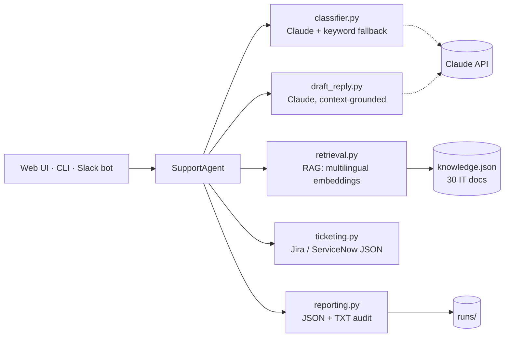

# IT Help Desk Support Agent 🤖

> A grounded, auditable AI support agent that triages IT requests and answers them using **Retrieval-Augmented Generation (RAG)** — never hallucinating policies, URLs, or ticket numbers.


[](https://github.com/Mushyl/it-helpdesk-agent/actions/workflows/ci.yml)


---

## Screenshot

<!-- Save a screenshot of the running web UI as docs/screenshot.png, then uncomment: -->
<!--  -->

The Streamlit web interface offers a clean single page: a request text area,
color-coded **category** and **urgency** badges, security/low-confidence
warning banners, the grounded reply, and an expandable panel with the
retrieved knowledge-base documents and similarity scores.

---

## What it does

An employee types an IT problem in plain language. The agent:

1. **Classifies** the request (category + urgency) with Claude.
2. **Retrieves** the most relevant passages from a local knowledge base (RAG).
3. **Drafts a grounded reply** using *only* the retrieved context — with strict anti-hallucination guardrails.
4. **Saves a full audit report** (JSON + TXT) for every run.

It is designed to **degrade gracefully**: if the LLM API is unreachable, a keyword-based classifier and a safe fallback reply keep the system usable.

---

## Architecture



**Pipeline:** `classify → retrieve → draft → report`. Each stage is independently testable and logged.

---

## Features

| Feature | Description |
|---|---|
| 🎯 **Auto triage** | Structured label (`VPN`, `SECURITY`, …) + urgency (`LOW/MEDIUM/HIGH`) |
| 📚 **RAG grounding** | Replies use only retrieved KB passages — no invented URLs or policies |
| 🛡️ **Security policy enforcer** | `SECURITY` requests are flagged (`security_flag: true`) in the audit log |
| 🕳️ **Knowledge-gap tracking** | Best similarity score < 0.3 → `low_confidence: true` (KB coverage gap) |
| ⏱️ **SLA tracker** | End-to-end latency recorded as `response_time_ms` per run |
| ♻️ **Graceful degradation** | Bilingual (EN/IT) keyword fallback classifier + safe fallback reply on API failure |
| 🌍 **Cross-lingual RAG** | Multilingual embeddings: questions in Italian (or 50+ languages) retrieve the right English KB docs, and the reply comes back in the user's language |
| 🧾 **Full auditability** | Every run persisted to `runs/run_*.json` and `runs/reply_*.txt` |
| 🔒 **Local embeddings** | `sentence-transformers` runs on-device — no embedding data leaves the machine |
| ⚙️ **12-factor config** | Models, top-k, thresholds and timeouts overridable via env vars — zero code changes |
| 💬 **Slack bot** | `/helpdesk <question>` slash command answers in-channel with the grounded reply and audit flags (Socket Mode) |
| 🎫 **Ticket export** | One-click export of each request as a ready-to-POST **Jira** and **ServiceNow** JSON payload |

---

## Prerequisites

- Python **3.10+**
- An Anthropic API key ([console.anthropic.com](https://console.anthropic.com))

## Installation

```bash
git clone https://github.com/Mushyl/it-helpdesk-agent.git
cd it-helpdesk-agent

python -m venv venv
# Windows
venv\Scripts\activate
# macOS / Linux
source venv/bin/activate

pip install -r requirements.txt
```

Copy `key.env.example` to `key.env` and paste your API key:

```env
ANTHROPIC_API_KEY=sk-ant-your-key-here
```

> `key.env` is git-ignored. It is the single source of truth for the API key
> and for any optional configuration override.

> **Note:** the first query downloads the multilingual embedding model
> (~470 MB) from Hugging Face — one time only, then it is cached locally.

## Usage

### Easy mode — web frontend (recommended)

Double-click the launcher in the project root:

- **Windows:** `start.bat`
- **macOS / Linux:** `start.command` (run `chmod +x start.command` once, then double-click from Finder)

Your default browser opens on the Streamlit interface: a single page with a
text area, a "Send" button, color-coded category/urgency badges, the grounded
reply, and an expandable "Technical details" panel with the retrieved KB
documents and similarity scores.

### Power-user mode — CLI

```bash
cd src
python main.py
```

Type your request, then an **empty line** to send. Example session:

```
Your IT request (empty line to send):
URGENT: I think I clicked on a phishing link and now my screen is doing weird things

============================================================
  CATEGORY : SECURITY
  URGENCY  : HIGH
  SUMMARY  : Employee clicked phishing link and is experiencing abnormal screen behavior.
------------------------------------------------------------
  REPLY:
------------------------------------------------------------
Hi,

We're taking this seriously and acting on it right away — thank you for
reporting this immediately.

1. Stop using your device. Do not attempt to fix the issue yourself.
2. Contact the IT Security team immediately at security@company.com or
   ext. 1001. Response time for high-priority incidents is 1 hour.
3. Do not enter any credentials on the affected device.
...
============================================================
  Report JSON : .../src/runs/run_20260515_133814.json
  Reply  TXT  : .../src/runs/reply_20260515_133814.txt
============================================================
```

Every detail in the reply (the email, the extension, the SLA) comes **only**
from the knowledge base — nothing is fabricated. Employees can write in
Italian or English: retrieval is cross-lingual and the reply mirrors the
language of the request.

### Slack bot

Add the Slack Socket Mode tokens to `key.env` (see `key.env.example`), then:

- **Windows:** double-click `start-slack.bat`
- **macOS / Linux:** `start-slack.command` (or `python src/slack_bot.py`)

In any channel, type `/helpdesk <your question>`: the bot replies in-channel
with the category, urgency, the grounded answer and any security / low-confidence
flags. It uses **Socket Mode**, so no public URL or inbound webhook is required.

### Ticket export

Every answer can be exported as a ready-to-POST ticket payload for **Jira**
(`POST /rest/api/3/issue`) and **ServiceNow** (`POST /api/now/table/incident`):
download buttons in the web UI, and both payloads are also embedded in every
`runs/run_*.json` audit report. Urgency and category are mapped to each tool's
native priority/scale (e.g. a `SECURITY`/`HIGH` request becomes a Jira *Incident*
with *High* priority).

### Docker

```bash
docker build -t it-helpdesk-agent .
docker run -e ANTHROPIC_API_KEY=sk-ant-... -p 8501:8501 it-helpdesk-agent
```

The image bundles the embedding model, so containers serve the UI on
`http://localhost:8501` with no cold-start download.

---

## Configuration

Every knob is an environment variable (set it in the shell or in `key.env`) —
see [src/config.py](src/config.py):

| Variable | Default | Purpose |
|---|---|---|
| `HELPDESK_LLM_MODEL` | `claude-sonnet-4-6` | Claude model for classification & replies |
| `HELPDESK_LLM_TIMEOUT` | `30` | Per-request timeout (seconds) |
| `HELPDESK_LLM_MAX_RETRIES` | `2` | Automatic retries on API errors |
| `HELPDESK_EMBEDDING_MODEL` | `paraphrase-multilingual-MiniLM-L12-v2` | Local embedding model |
| `HELPDESK_TOP_K` | `3` | KB documents retrieved per query |
| `HELPDESK_LOW_CONFIDENCE_THRESHOLD` | `0.30` | Cosine score below which a run is flagged `low_confidence` |
| `HELPDESK_JIRA_PROJECT_KEY` | `IT` | Jira project key used in exported tickets |
| `SLACK_BOT_TOKEN` / `SLACK_APP_TOKEN` | — | Slack Socket Mode tokens (only needed to run the bot) |

---

## Project structure

```
it-helpdesk-agent/
├── src/
│   ├── kb/knowledge.json     # 30 IT docs across 6 categories
│   ├── runs/                 # Auto-generated audit reports (git-ignored)
│   ├── app.py                # Streamlit web frontend (recommended)
│   ├── main.py               # CLI entry point
│   ├── config.py             # Central config — env-var overridable
│   ├── agent.py              # Pipeline orchestrator + audit signals
│   ├── api_client.py         # Anthropic client (singleton, timeout, retries)
│   ├── prompts.py            # Classifier & reply prompt templates
│   ├── classifier.py         # Claude classification + bilingual keyword fallback
│   ├── retrieval.py          # RAG: multilingual local embeddings (cosine)
│   ├── draft_reply.py        # Grounded reply generation
│   ├── reporting.py          # JSON/TXT audit persistence
│   ├── ticketing.py          # Jira / ServiceNow ticket payloads
│   └── slack_bot.py          # Slack bot front-end (Socket Mode)
├── tests/                    # pytest suite (52 tests, run offline)
├── .github/workflows/ci.yml  # GitHub Actions: runs the tests on every push
├── Dockerfile                # Self-contained container image
├── start.bat                 # Windows launcher — web UI
├── start.command             # macOS / Linux launcher — web UI
├── start-slack.bat           # Windows launcher — Slack bot
├── start-slack.command       # macOS / Linux launcher — Slack bot
├── requirements.txt          # Runtime dependencies
├── requirements-dev.txt      # + pytest, for development & CI
├── key.env.example           # Template for secrets & config overrides
├── key.env                   # API key (git-ignored)
└── README.md
```

## Tech stack & rationale

| Choice | Why |
|---|---|
| **Claude Sonnet 4.6** | Strong instruction-following — critical for strict no-hallucination guardrails |
| **sentence-transformers (paraphrase-multilingual-MiniLM-L12-v2)** | Free, **local**, multilingual embeddings — Italian questions match the English KB, no data leaves the machine |
| **NumPy dot-product** | Embeddings are explicitly L2-normalised at encode time, so dot product = cosine similarity, zero extra deps |
| **Singleton caching** | API client, model, KB, and KB embeddings are loaded once and reused |
| **`logging` everywhere** | Production-grade observability; no stray `print()` in library code |
| **python-dotenv** | Secrets stay out of source control |
| **slack-bolt** | Official Slack framework; Socket Mode means no inbound webhook or public URL to operate the bot |

## How RAG works here

```
query ──embed──► [query vector]
                       │  dot product vs.
                       ▼
   [30 KB doc vectors] ──► top-3 most similar passages
                                     │
                                     ▼
        prompt = guardrails + retrieved context + question
                                     │
                                     ▼
                          Claude → grounded reply
```

The model is **only ever shown the retrieved passages**. If they don't contain
the answer, it must reply with a fixed fallback phrase instead of guessing.

## Testing

The core logic is covered by a fast, offline test suite (the Anthropic API and
the embedding model are mocked, so no key or network is required):

```bash
pip install -r requirements-dev.txt
pytest
```

```
52 passed
```

Tests cover: defensive JSON parsing, classification normalisation, the bilingual
keyword fallback (incl. a regression test for Italian security messages), the
RAG top-k selection and caching (with a stubbed embedding model), the three
audit signals (`security_flag`, `low_confidence`, `response_time_ms`), the
grounded-reply fallback, the end-to-end orchestration wiring, the Jira /
ServiceNow ticket mapping, and the Slack Block Kit formatting. Every push runs
them automatically via GitHub Actions.

## Roadmap

Honest about what this is *not* yet — and what turning it into a production
service would look like:

- **REST API (FastAPI)** on top of `SupportAgent`, plus live ticket creation
  (POST the generated Jira / ServiceNow payloads directly to their REST APIs).
- **Persistent vector index** (FAISS / Chroma) — at 30 documents a full scan
  is optimal; at tens of thousands an ANN index becomes necessary.
- **Conversation memory** — today each request is stateless by design.
- **Evaluation harness** — automated groundedness / retrieval-recall scoring
  on a labelled test set, beyond the current `low_confidence` heuristic.
- **AuthN/Z & multi-tenancy** for a real SaaS deployment.

## Ethical considerations

This is a **demonstration project**, not a certified production system.

- Replies are grounded in a sample knowledge base; in production the KB must be
  curated and kept up to date by the organization.
- The agent is for **IT support only**. It is not designed for, and must not be
  used for, medical, legal, or financial advice.
- All runs are logged to `runs/` for auditing. In a real deployment those logs
  may contain personal data and must be handled per the applicable data-
  protection policy (e.g. GDPR).
- A human should remain in the loop for security incidents and any
  `low_confidence` response.

## License

MIT © Cristian Renni — see [LICENSE](LICENSE).
